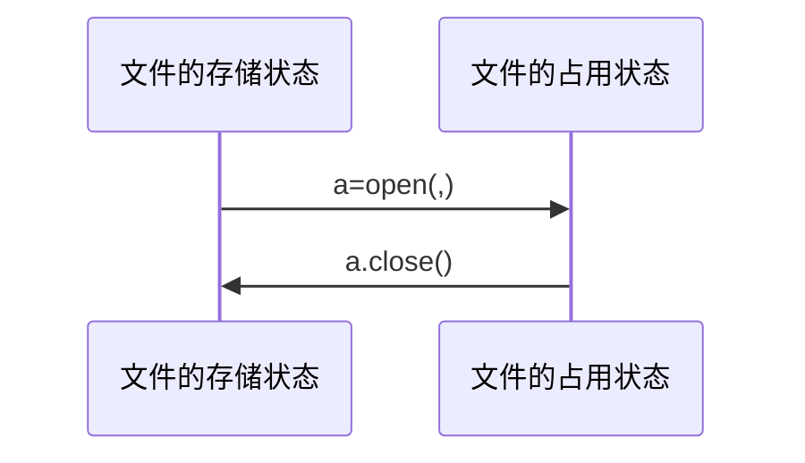

[toc]

 # 文件和数据

## 文件的使用

### 文件的类型

* 文件的理解

  ==文本文件vs二进制文件== 

  * 文本文件和二进制文件只是文件的展示方式
  * 本质上，所有文件都是二进制形式存储的
  * 形式上，所有文件采用两种方式展示

* 文本文件

  ==文件是数据的抽象和集合== 

  * 由==单一特定编码== 组成的文件，如UTF-8编码
  * 由于存在编码，也被堪称存储着的长字符串
  * 适用于例如：.txt文件、.py文件

* 二进制文件

  ==文件是数据的抽象和集合== 

  * 直接由比特0和1组成，==没有统一的字符编码== 
  * 一般存在二进制0和1的组织结构，即文件格式
  * 适用于例如：.png文件、.avi文件

* 文本文件VS二进制文件

  f.txt文件保存"中国是一个伟大的国家"

  * ```python 
    #文本形式打开文件
    tf =open ("f.txt","rt")
    print(tf.readline())
    tf.close()
    >>>中国是一个伟大的国家
    ```

  * ```python
    #二进制文件打开文件
    bf = open ("f.txt","rb")
    print(bf.readline())
    bf.close()
    >>>我不想打了
    ```

### 文件的打开和关闭

==文件处理步骤：打开-操作-关闭== 



* 读文件

  `a.read(size)` 

  `a.readline(size)`

  `a.readlines(hint)`

* 写文件

  `a.write(s)`

  `a.writelines(lines)`

  `a.seek(offset)`

* 文件的打开

  `<变量名>=open(<文件名>,<打开模式>)`

  文件名： **文件路径和名称**  **源文件同目录可省路径** 

  * 绝对路径 

    因为\在python中指的是转义字符的意思 所以文件路径用‘/’

    因为'\\\\'在python中含义是‘\\'所以可以以下两种方式

    `E:/python`或者`E:\\python\\f.txt`

  * 相对路径    打开文件与当前程序之间的路径

    `./python/f.txt`

    从可执行程序的当前目录起，找它的python目录，以及这个目录下的f.txt文件

    `f.txt`

    所打开文件与程序在相同目录里，可以直接使用文件名称f.txt

  打开模式：文本or二进制

  | 文件的打开模式 | 描述                                                         |
  | -------------- | ------------------------------------------------------------ |
  | 'r'            | 只读模式。**默认值**。如果文件不存在，则返回FileNotFoundError<br>我们可以使用`try:except:else`来捕捉这种异常 |
  | 'w'            | 覆盖写模式，文件不存在则创建，存在则完全覆盖                 |
  | 'x'            | 创建写模式，文件不存在则创建，存在则返回FileExistsError      |
  | 'a'            | 追加写模式，文件不存在则创建，存在则在文件最后追加内容       |
  | 'b'            | 二进制文件模式                                               |
  | 't'            | 文本文件模式，**默认值**                                     |
  | '+'            | 与r/w/x/a一同使用，在原功能基础上增加同时读写功能            |

* 文件的关闭

  `<变量名>.close()`

  <变量名> --文件句柄

  如果我们一直未手动关闭该文件，那么python解释器会在程序结束时关闭该文件

### 文本内容读取方法

| 操作方法                | 描述                                                         |
| ----------------------- | ------------------------------------------------------------ |
| <f\>.read(size=-1)      | 读入全部内容，如果给出参数，读入前size长度<br>>>>s=f.read(2)<br>中国 |
| <f\>.readline(size=-1)  | 读入一行内容，如果给出参数，读入改行前size长度<Br>>>>s = f.readline()<br>中国是一个伟大的国家 |
| <f\>.readlines(hint=-1) | 读入文件所有行，以每行为元素形成列表<br>如果给出参数，读入前hint行<br>>>>s=f.readlines()<br>['中国是一个伟大的国家'] |

* 文件的全文本操作

  遍历全文本：方法一

  ```python 
  fname=input("请输入要打开的文件名称")
  fo =open(fname,"r")
  txt =fo.read()
  #对全文txt进行处理
  fo.close()
  ```

  * 一次读入，统一处理
  * 弊端：当文件的总量非常大，读入内存时将会耗费非常多的时间和资源

​      方法二：按数量读入处理方法 

```python 
fname = input("请输入要打开的文件名称")
fo =open(fname,"r")
txt =fo.read(2)
while txt !="":
    #对txt进行处理
    txt=fo.read(2)
fo.close()
```

 				按数量读入，逐步处理

* 文件的逐行操作

  ==逐行遍历文件== 

  * 方法一

    ```python 
    fname =input("请输入要打开的文件名称")
    fo =open(fname,"r")
    for line in fo.readlines():
        print(line)
    fo.close()
    ```

    * 一次读入，分行处理

  * 方法二

    ```python 
    fname =input ("请输入要打开的文件名称")
    fo =open(fname,"r")
    for line in fo :
        print(line)
    fo.close()
    ```

    * 分行 读入，逐行处理

### 数据的写入

| 操作方法               | 描述                                                         |
| ---------------------- | ------------------------------------------------------------ |
| <f\>.write(s)          | 向文件写入一个字符串或字节流<br>>>>f.write("中国是一个伟大的国家") |
| <f\>.writelines(lines) | 将一个元素全为字符串的列表写入文件<br>>>>ls=['中国','法国','美国']<br>>>>f.writelines(ls)<br>中国法国美国[^1] |
| <f\>.seek(offset)      | 改变当前文件操作指针的位置<br>offset含义如下：0-文件开头；1-当前位置；2-文件结尾<br>>>>f.seek(0)  #回到文件开头 |

[^1]:此处没有换行，只是将列表的个字符串拼接起来

## 自动轨迹绘制

### 问题分析

==自动轨迹绘制== 

* 需求：根据脚本来绘制图形
* 不是写代码而是写数据绘制轨迹

==基本思路== 

* 步骤一：定义数据文件格式（接口）
* 步骤二：编写程序，根据文件接口解析参数绘制图形
* 步骤三：编制数据文件

### 数据接口定义

==非常具有个性色彩== 

such as :300，1，144，0，1，0

300：行进距离

1：转向判断——————0：左转，1：右转

144：转向角度

0，1，0：RGB三个通道的颜色，0-1之间的浮点数

### 自动轨迹绘制

```python 
#AutoTraceDraw.py
import turtle as t
t.title('自动轨迹绘制')
t.setup(800,600,0,0)
t.pencolor("red")
t.pensize(5)
#数据获取
detals=[]
f=open("data.txt")
for line in f:
    line =line.replace("\n","")
    detals.append(list(map(eval,line.split(","))))
f.close()
#自动绘制
for i in range(len(detals)):
    t.pencolor(datals[i][3],datals[i][4],datals[i][5])
    t.fd(datals[i][0])
    if datals[i][1]:
        t.right(datals[i][2])
     else:
        t.left(datals[i][2])
```

map()函数作用是将第一个参数的功能作用于第二个参数的每一个元素

他的第一个参数是一个函数的名字，第二个参数是迭代类型、

简单说就是对一个列表或者集合这样的组合数据类型的每一个元素，都执行一次第一个参数所对应的函数

## 一维数据格式化和处理

* 一维数据

  ==由对等关系的有序或无序数据构成，采用线性方式组织== 

  *   对应列表、数组和集合等概念

* 二维数据

  ==由多个一维数据构成，是一维数据的组合方式== 

* 多维数据

  ==由一维或二维数据在新维度上扩展形成== 

* 高维数据    **键值对** 

  ==仅利用最基本的二元关系展示数据间的复杂结构== 

### 数据的操作周期

==存储<->表示<->操作== 


### 一维数据表示

==如果数据间有序：使用列表类型== 

`ls = [3.1398,3.1349,3.1376]`

* 列表类型可以表达一维有序数据
* for循环可以遍历数据，进而对每个数据进行处理

==如果数据间无序：使用集合类型== 

`st = [3.1398,3.1349,3.1376]`

* 集合类型可以表达一维无序数据
* for循环可以遍历数据，进而对每个数据进行处理

### 一维数据的存储

* 存储方式一：空格存储

  `中国 美国 日本 德国 法国 应该 意大利` 

  * 使用一个或多个空格分隔进行存储，不换行
  * 缺点：数据中不能存储空格

* 存储方式二：逗号分隔

  `中国,美国,日本,德国,法国,英国,意大利`

  * 使用英文半角逗号分隔数据进行存储，不换行
  * 缺点：数据中不能有英文逗号

* 其他方式   

  `中国$美国$日本$德国$法国$英国$意大利`

  * 使用其他符号或符号子u和分隔，建议采用**特殊符号**
  * 缺点：需要根据数据特点定义，通用性差

## 一维数据的处理

==存储<->表示== 


* 将存储的数据读入程序
* 将程序表示的数据写入文件

### 一维数据的处理

####  读入处理

==从空格分隔的文件读入数据== 

`中国 美国 日本 德国 法国 应该 意大利` 

```python 
txt=open (fname).read()
ls =txt.split()
f.close()
#ls返回列表
```

==从特殊符号分隔的文件读入数据== 

`中国$美国$日本$德国$法国$英国$意大利`

```python 
txt = open (fname).read()
ls = txt.split("$")
f.close()
```

#### 写入处理

==采用空格分隔方式将数据写入文件== 

```python 
ls = ['中国','美国','日本']
f =open (fname,'w')
f.write(' '.join(ls))
f.close()
```

==采用特殊分隔方式将数据写入文件== 

```python 
ls = ['中国','美国','日本']
f =open (fname,'w')
f.write('$'.join(ls))
f.close()
```

## 二维数据的格式化和处理

### 二维数据的表示

==数据维度是数据的组织形式== 

* 一维数据：列表和集合类型
  * 数据间有序--列表
  * 数据间无序--集合
* 二维数据：列表类型

### CSV数据存储格式

==CSV:Comma-Separated Values== 

* 国际通用的一二维数据存储格式，一般.csv扩展名
* 每行一个一维数据，采用逗号分隔，五分行
* Excel和一般编辑软件都可以读入或另存为csv文件

举个栗子：

| 城市 | 环比  |
| ---- | ----- |
| 北京 | 101.5 |

转化为csv格式

```CSV
城市,环比
北京,101.5
```

CSV数据存储格式中的约定：

* 如果每个元素缺失，逗号仍要保留

* 二维数据的表头可以作为数据存储，也可以另行存储

* 逗号为英文半角逗号，逗号与数据之间无额外空格

  加引号或添加转义符来表示数据中的逗号并不是表达分割元素的符号而是数据中的逗号

### 二维数据的存储

==按行存？按列存？== 

* 按行存或者按列存都可以，具体由程序决定
* 一般索引习惯：`ls[row][column]`，先行后列
* 根据一般习惯，外层列表每一个元素都是一行，按行村

### 二维数据的处理

==从CSV格式的文件读入数据== 

```python 
fo = open(fname)
ls =[]
for line in fo :
    line = line.replace("\n","")
    ls.append(line.split(","))
fo.close()
```

==将数据写入CSV格式文件==

```python 
ls =[[],[],[]]  #二维列表
f = open(fname,'w')
for item in ls:
    f.write(','.join(item)+'\n')
f.close()
```

#### 二维数据的逐一处理

==采用二层循环== 

```python 
ls =[[1,2],[3,4],[5,6]] # 二维列表
for row in ls:
    for column in row:
        print(column)
```

## worldcloud库

### 概述

==wordcloud是一个优秀的词云展示第三方库== 

* 词云就是将词语通过图形可视化的方式

#### wordcloud库基本使用

==wordcloud库把词云当作一个WordCloud对象== 

* worldcloud.WordCloud()代表一个文本对应的词云

* 可以根据文本中的词语出现的频率等参数绘制词云
* 绘制词云的形状、尺寸和颜色都可以设定

#### worldcloud库常规方法

==w=wordcloud.WordCloud()== 

* 以WordCloud对象为基础
* 配置参数、加载文本、输出文件

| 方法                | 描述                                                         |
| ------------------- | ------------------------------------------------------------ |
| w.generate(txt)     | 向WordCloud对象W中加载文本TXT<br>>>> w.generate("python and wordcloud") |
| w.to_file(filename) | 将此云输出为图像文件，.png或.jpg格式<br>>>>w.to_file("outfile.png") |

举个例子

```python 
import wordcloud
c = wordcloud.WordCloud()
c.generate("word cloud by python")
c.to_file("pywordcloud.png")
# 生成图片的默认宽度是400像素，高度是200像素
```

从文本到图片，wordcloud做了什么

1. 分隔：以空格分隔单词
2. 统计：单词出现次数并过滤
3. 字体更具统计配置字号
4. 布局：颜色环境尺寸

#### 配置对象参数

==w=wordcloud.WordCloud(<参数>)== 

| 参数             | 描述                                                         |
| ---------------- | ------------------------------------------------------------ |
| width            | 指定词云对象生成图片的宽度，默认为400像素<br>>>>w=wordcloud.WordCloud(width=600) |
| height           | 指定词云对象生成图片的高度。默认200像素<BR>>>>w=wordcloud.WordCloud(height=400) |
| min_font_size    | 指定词云中字体的的最小字号，默认4号<br>>>>w=wordcloud.WordCloud(Min_font_size=10) |
| max_font_size    | 指定词云中字体的最大字号，根据高度自动调节<br>>>>w=wordcloud.WordCloud(max_font_size=20) |
| font_step        | 指定词云中字体字号的步进间隔（字体多一些的，字就会更大些），默认为1<br>>>>w=wordcloud.WordCloud(font_step=2) |
| font_path        | 只当字体文件的路径，默认None<br>>>>w=wordcloudWordCloud(font_path="msyh.ttc")<br>#.ttc文件为字体文件 |
| max_words        | 指定词云显示的最大单词数量，默认200<br>>>>w=wordcloudWordCloud(max_words=20) |
| stop_words       | 指定词云的排除词列表，既不显示的单词列表<br>>>>w=wordcloudWordCloud(stop_words={"python"}) |
| mask             | 指定词云形状。默认为长方形，需要引用imread()<BR>>>>from scipy.misc import imread<br>>>>mk=imread("pic.png")#mk获取一种图片形状<br>>>>w=wordcloudWordCloud(mask=mk) |
| background_color | 只当词云图片的背景颜色，默认为黑色<br>>>>w=wordcloudWordCloud(background_color="white") |

#### wordcloud应用实例

1. 英文

   ```python 
   import wordcloud
   txt ="life is short ,you need python"
   w =wordcloudWordCloud(\
            background_color="white")
   w.generate(txt)
   w.to_file("pywcloud.png")
   ```

   * ***以空格分隔单词*** 

2. 中文

   在中文我们没办法使用空格区分单词，需要我们首先对中文文本进行分词---**jieba**

   ```python 
   import jieba 
   import wordcloud
   txt="叽里呱啦叽里呱啦"
   w=wordcloud.WordCloud(width=1000,font_path="msyh.ttc",height=700)
   w.generate(" ".join(jieba.lcut(txt)))
   ```

   * 中文需要先分词并组成空格分隔字符串


## 实例 政府工作报告词云

### 问题分析

==直观理解政策文件== 

* 需求：对于政府工作报告等政策文件，如何直观理解？
* 体会直观的价值：生成词云&优化词云


### 基本思路

* 步骤1:读取文件、分词整理
* 步骤2：设置并输出词云
* 步骤3：观察结果、优化迭代

 ```python 
#GovRptWordCloudv1.py
import jieba
import wordcloud
f=open("新时代中国特色社会主义.txt","r",encoding="utf-8")
t=f.read()
f.close()
ls=jieba.lcut(t)
txt=" ".join(ls)
w=wordcloud.WordCloud(font_path="msyh.ttc",\
               width =1000,height =700,background_color="white")
w.generate(txt)
w.to_file("grwordcloud.png")
 ```

### 举一反三

==拓展能力== 

* 了解wordcloud更多参数，拓展词云能力
* 特色慈云：设计一款属于自己的特色词云风格
* 更多文件：用更多文件练习词云生成