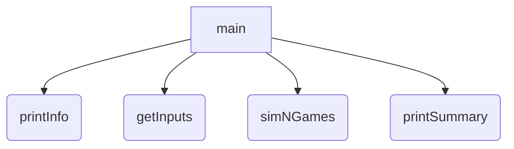
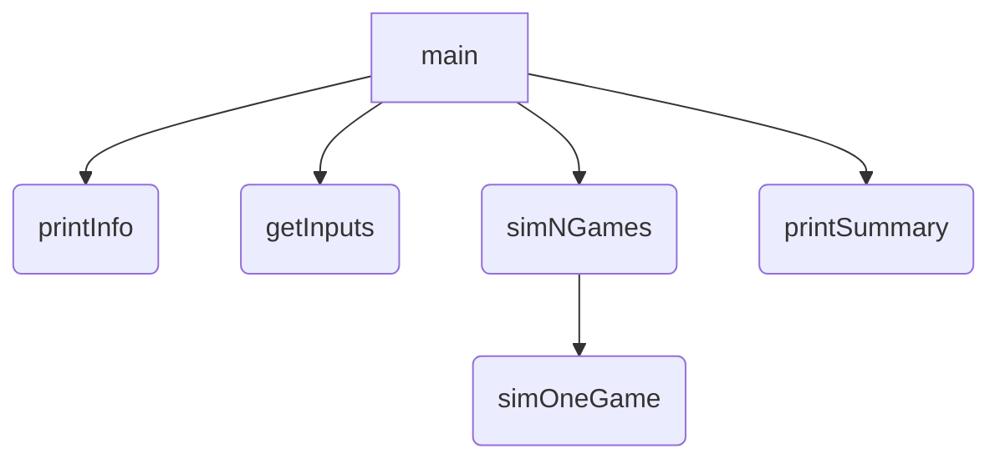

[toc]

# 程序设计方法学

## 体育竞技分析

* 需求：毫厘是多少？如何科学分析体育竞技比赛
* 输入：球员的水平
* 输出：可预测的比赛成绩

### 问题分析

**体育竞技分析：模拟N场比赛**

* 计算思维：抽象+自动化
* 模拟：抽象比赛过程+自动化执行N场比赛
* 当N越大时，比赛结果分析会越科学

 比赛规则

* 双人击球比赛：A&B，回合制，5局3胜
* 开始时乙方先发球，直至判分，接下来胜者发球
* 球员只能在发球局得分，15分胜一局

### 自顶而下，自底向上

#### 自顶而下（设计)

==复杂问题的有效方法== 

* 将一个总问题表达为若干个小问题组成的形式
* 使用同样方法进一步分解小问题
* 直至，小问题可以用计算机简单明了的解决

#### 自底向上（执行）

==逐步组建复杂系统的有效测试方法== 

* 分单元测试，逐渐组装
* 按照自顶向下相反的路径操作
* 直至，系统各部分以组装的思路都经过测试和验证

### 体育竞技实例讲解

==程序总体框架及步骤== 

* 步骤1：打印程序的介绍性信息式	-printInfo()
* 步骤2：获得程序运行参数：proA,proB,n    -getInputs()
* 步骤3：利用球员A和B的能力值，模拟N局比赛    -simNGames()
* 步骤4：输出球员A和B获胜比赛的场次及概率    -printSummary()


**第一阶段：程序总体框架及步骤**



```python 
def main ():
    printInfo()
    probA,proB,n=getInputs()
    winsA,winsB =simNGames(n,probA,probB)
    printSummary(winsA,wimsB)
```

#### printInfo()

==介绍性内容，提高用户体验== 

```python 
def printInfo():
    print("这个程序模拟两个选手A和B的某种竞技比赛")
    print("程序运行需要A和B的能力值（以0到1之间的小数表示）")
```

#### getInputs()

```python 
def getInputs():
    a = eval(input("请输入选手A的能力值（0-1）："))
    b = eval (input("请输入选手B的能力值（0-1）："))
    n = eval(input("模拟比赛场次:"))
    return a,b,n
```

#### printSummary()

```python 
def printSummary(winsA,winsB):
    n =winsA+winsB
    print("经济分析开始，共模拟{}场比赛".format(n))
    print("选手A获胜{}场比赛，占比{:.0.1%}".format(winsA,winsA/n))
    print("选手B获胜{}场比赛，占比{:0.1%}".format(winsB,winsB/N))
    
```

**第二阶段： 步骤3 模拟N局比赛** 



```python 
def simNGame(n,probA,probB):
    winsA,winsB = 0,0
    for i in range(n):
        scoreA,scoreB = simOneGame(proA,proB)
        if scoreA >scoreB:
            winsA +=1
        else:
            winsB+=1
    return winsA,winsB
```

**第三阶段** 

 ```mermaid
graph TD
A[main] -->B(printInfo)
A -->   C(getInputs)
A --> D(simNGames)
A  --> E(printSummary)
D --> F(simOneGame)
F --> G(gameOver)
 ```


```python 
def simOneGame(proA,proB):
    scoreA,scoreB =0,0
    serving ="A"    #发球选手为A
    while not gameOver(scoreA,scoreB):
        if serving =="A": 
            if random()<probA:
                scoreA +=1
            else:
                serving ="B"
        else: 
            if random()<proB:
                score +=1
            else:
                serving ="A"
    return scoreA,scoreB
def gameOver(a,b):
    return a==15 or b==15
```

## python 程序设计思维

### 计算思维和程序设计

#### 计算思维

==第三种人类思维特征== 

* 逻辑思维：推演和演绎，数学为代表，A ->B B->C A->C
* 实证思维：实验和验证，物理为代表，引力波<-实验
* 计算思维：设计和构造，计算机为代表，汉诺塔递归

==抽象和自动化== 

* 计算思维：Computatianal Thinking
* ==抽象==问题的计算过程，利用计算机==自动化== 求解
  * 计算思维基于计算机强大的算力及海量数据
  * 抽象计算过程，关注设计和构造，而非因果
  * 以计算机程序设计为实现的主要手段
* 计算思维是基于计算机的思维方式
* 编程是将计算思维变成现实的手段

### 计算生态与python语言

==计算思维== 	

从开源运动说起

* 1983，Richard Stallman启动GNU项目
  * 大教堂模式
* 1989，GNU通用许可协议[^2]诞生，==自由软件[^1]时代到来== 
* 1991，Linux Torvalds发布了Linux内核
  * 集市模式
* 1998，网景浏览器开源，产生了Mozila ==开源生态逐步建立== 

[^1]:软件产不再像工业产品一样通过商业来分发和销售，而是通过互联网，通过免费的拷贝和使用来分发，让更多的人能用得起或用得上软件
[^2]:第一个迈向软件只是产权保护的许可协议

==计算生态== 

**开源思想深入原话和发展，形成了计算生态** 

计算生态以开源项目为组织形式，充分利用“共识原则”和”社会利他“组织人员，在竞争发展、相互依存和迅速更迭中完成信息技术的更新换代，形成了技术的自我演化路径。

==计算生态没有顶层设计，以功能为单位，具备三个特点== 

* 竞争发展
* 相互依存
* 迅速更迭


举个python例子

* 以开源项目为代表的大量第三方库

  ==python语言提供>15万个第三方库== 

* 库的建设经过野蛮生长和自然选择’

  ==同一个功能，python语言2个以上第三方库== 

* 库之间相互关联使用，依存发展

  ==python库间广泛联系，逐级封装== 

* 社区庞大，新技术更迭迅速

  ==AlphaGo深度学习算法采用python语言开源== 

  

  

  **API [^3] != 生态**

[^3]:应用程序生态

##### 计算生态的价值

==创新：跟随创新、集成创新、原始创新== 

* 加速科技类应用创新的重要支撑
* 发展科技产品商业价值的重要模式
* 国家科技系安全和稳固的基础

##### 计算生态的运用

==刀耕火种 ->站在巨人的肩膀上== 

* 编程的起点不是算法而是**系统** 
* 编程如同搭积木，利用计算生态为主要模式
* 编程的目标是**快速**解决问题
* 优质的计算生态  [推荐的网站](http://python123.io)

### 用户体验与软件产品

#### 用户体验

==实现功能 ->关注体验== 

* 用户体验指用户对产品建立的主观感受和认识
* 关心功能实现，更要关心用户体验，才能做出好产品
* 编程只是手段，不是目的，程序最终为人类服务

#### 提高用户体验的方法

方法一：进度展示

* 如果长须需要计算时间，可能 产生等待，请增加进度展示
* 如果程序有若干步骤，需要提供提示用户，请增加进度展示
* 如果程序可能存在大量次数的循环，请增加进度展示

方法二：学会异常处理

* 当获得用户输入，对合规性需要检查，需要异常处理
* 当读写文件时，对结果惊醒判断，需要异常处理
* 当进行输入输出时，对运算结构进行判断，需要异常处理

其它类方法

* 打印输出：特定位置，输出程序运行的过程信息

* 日志文件：对程序异常及用户使用进行定期记录

* 帮助信息：给用户多种方式提供帮助信息

   		

  ​			==软件程序->软件产品== 

  **用户体验** 时程序到产品的关键环节

## 基本程序设计模式

==从IPO开始== 

* I：Input输入，程序的输入
* P:Process处理，程序的主要逻辑
* O：Output输出，程序的输出


* 确定IPO：明确计算部分及功能边界
* 编写程序：将计算求解的设计变成现实
* 调试程序：确保程序按照正确的逻辑能够正确运行


==模块化设计== 

* 通过函数或对象封装将程序划分为子模块及模块间的表达
* 具体包括：主程序、子程序和子程序间的关系
* 分而治之：一种分而治之、分层抽象、体系化的设计思想


* 紧耦合：两个部分之间交流很多，无法独立存在
* 松耦合：两个部分之间交流很少，可以独立存在
* 模块内部紧耦合，模块之间松耦合


==配置化设计== 

* **引擎+配置** ：程序执行和配置分离，将可选参数配置化
* 将程序开发变成配置文件编写，拓展功能而不修改程序
* 关键在于接口设计，清晰明了、灵活可拓展

### 应用开发的四个步骤

==从应用需求到软件产品== 


* 产品定义：对应用需求充分理解和明确定义

  产品定义，而不仅时功能定义，要充分考虑商业模式

* 系统框架：以系统方式思考产品的技术实现

  系统框架，关注数据流、模块化、体系框架

* 设计与实现：结合架构完成关键设计及系统实现

  结合可拓展性、灵活性等进行设计优化

* 用户体验：从用户角度思考应用效果

  用户至上，体验优先，以用户为中心

## python第三方库安装

### 看见更大的python世界

#### python社区

==PyPI==   

> https://pypi.org/

* PyPI:Python Package Index
* PSF维护的展示全球python计算生态的主站
* 学会检索并利用PyPI,找到合适的第三方库开发程序

**实例：开发与区块链相关的程序**

* 第一步：在pypi.org搜索blockchain
* 第二步：挑选适合开发目标的第三方库作为基础
* 第三步：完成自己需要的功能


#### 安装PYTHON第三方库

==三种方法== 

* 方法一：（主要方法）使用pip命令
* 方法二：集成安装方法
* 方法三：文件安装方法

### 第三方库的pip安装方法

#### pip安装方法

==使用pip安装工具（命令行下执行）==

==主要方法，适合99%以上情况== 

* 适合window,mac和Linux等操作系统
* 未来获取第三方库的方式，目前的主要方式
* 适合99%以上情况，需要联网安装

#### 常用的pip命令

`pip install <第三方库名>` 

* 安装指定的第三方库

`pip install -U <第三方库名>`

* 使用`-u`标签更新已安装的指定第三方库

`pip uninstall <第三方库名>`

* 卸载指定的第三方库

`pip download <第三方库名>`

* 下载但不安装指定的第三方库

`pip show <第三方库名>`

* 列出某个指定的第三方库的详细信息

`pip search <关键词>`

* 根据关键词在名称和介绍中搜索第三方库

`pip list`

* 列出当前系统已安装的第三方库

### 第三方库的集成安装方法

**集成安装方法** 

==Anaconda== 

> https://www.continuum.io

* 支持近800个第三方库
* 包含多个主流工具
* 适合数据计算领域开发

### 第三方库的文件安装方法

==为什么有些第三方库用pip可以下载，但无法安装==

* 某些第三方库pip下载后，需要编译再安装
* 如果操作系统没有编译环境，则能下载但不能安装
* 可以直接下载编译后的版本用于安装吗？

 

**UCI页面** 

> http://www.lfd.uci.edu/~gohlke/pythonlibs/

**实例：安装wordcloud库**

* 步骤一：在UCI页面上搜索wordcloud
* 步骤二：下载对应版本的文件
* 步骤三：使用`pip install <文件名>`安装

## os库的使用

### os库的基本介绍

==os提供通用的、基本的操作系统交互功能== 

* os库时Python标准库，包含几百个函数
* 常用路径操作、进程管理，环境参数等几类

我们本课程只介绍与这三个方面相关的函数

* 路径操作：os.path子库，处理文件路径及信息
* 进程管理：启动系统中的其他程序
* 环境参数：获得系统软硬件信息等环境参数

###  os库之路径操作

==os.path字库以path为入口，用于操作和处理文件路径== 

path:目录或包含文件名称的文件的路径

```python 
import os.path
import os.path as op
```

|            函数            | 描述                                                         |
| :------------------------: | ------------------------------------------------------------ |
|   os.path.abspath(path)    | 返回path在当前系统中的绝对路径<br>>>>os.path.abspath("file.txt") |
|   os.path.normpath(path)   | 归一化path的表示形式，同意用\\\分隔路径<br>>>>os.path.normpath("D://PYE//file.txt")<br>'D:\\\\PYE\\\\file.txt' |
|   os.path.relpath(path)    | 返回当前程序与文件之间的相对路径（relative path)<br>>>>os.path.relpath("C://PYE//file.txt")<br>'..\\\\..\\balabala' |
|   os.path.dirname(path)    | 返回path中的目录名称<br>>>>os.path.dirname("D://PYE//file.txt")<br>"D://PYE" |
|   os.path.basename(path)   | 返回path最后的文件名称<br>>>>os.path.basename("D://PYE//file.txt")<br>'file.txt' |
| os.path.join(path,*paths)  | 组合path与paths，返回一个路径字符串<br>>>>os.path.join("D:/","PYE/file.txt")<br>'D:/PYE/file.txt' |
|    os.path.exists(path)    | 判断path对应文件或目录是否存在，返回True或False<Br>>>>os.path.exists("D://PYE//file.txt") |
|    os.path.isfile(path)    | 判断path所对应是否为已存在的文件，返回True或False            |
|    os.path.isdir(path)     | 判断path所对应的是否为已存在的目录，返回True或False          |
| os.path.getatime(path)[^5] | 返回path对应文件或目录上一次的访问时间   浮点数              |
| os.path.getmtime(path)[^6] | 返回path对应文件或目录最近一次修改时间   浮点数              |
| os.path.getctime(path)[^7] | 返回path对应文件或目录的创建时间    浮点数<br>>>>time.ctime(os.path.getctime("D:/PYE/file.txt")) |
|   os.path.getsize(path)    | 返回path对应文件的大小，以字节为单位                         |

[^5]:a   acess 访问
[^6]: m   modify  修改
[^7]:  c  create 创建

### os库之进程管理

==os.system(command)== 

* 执行程序或命令command
* 在window系统中，返回值为cmd的调用返回信息

```python 
import os 
os.system("C:巴拉巴拉巴拉巴拉")  #os.system具备调用其他应用程序的功能
>>> 0   # 0表示程序正常退出
```

### os库之环境参数

==获取或改变系统环境信息== 

| 函数           | 描述                                                         |
| -------------- | ------------------------------------------------------------ |
| os.chdir(path) | 修改当前程序操作的路径<br>>>>os.chdir("D:")                  |
| os.getcwd()    | 返回程序的当前路径<br>>>>os.getcwd()<br>'D:\\\\'             |
| os.urandom(n)  | 获得n个字节长度的随机字符串，通常用于加密运算<br>有些字符不好表达出来，就是十六进制表示 |

## 第三方库安装脚本

### 问题分析

==第三方库自动安装脚本== 

* 需求：批量安装第三方库需要人工干预，能否自动安装？
* 自动执行pip主义根据安装需求安装

**如何自动执行一个程序？例如pip?**

###  第三方库安装脚本实例讲解

```python 
#BatchInstall.py
import os 
libs = {"numpy","wordcloud"balabalabala}
try :
    for lib in libs :
        os.system("pip install"+lib)
    print("Successful")
except:
    print("Failed Somehow")
```

###  举一反三

==自动化脚本+== 

* 编写各类自动化运行程序的脚本，调用已有程序
* 拓展应用：安装更多的第三方库，增加配置文件
* 扩展异常检测：捕获更多异常类型，程序更稳定友好